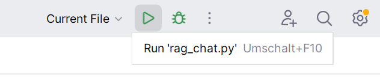
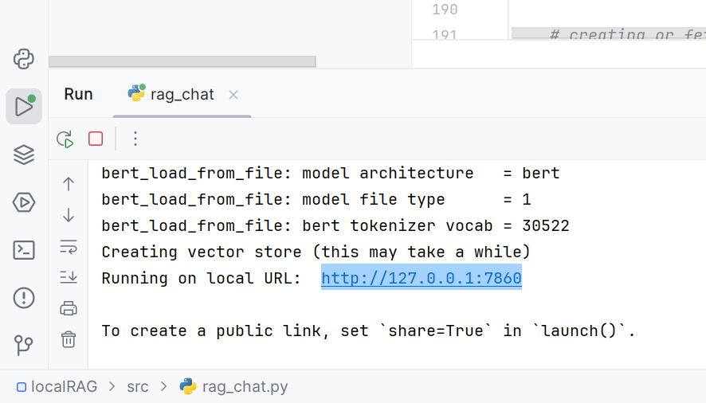
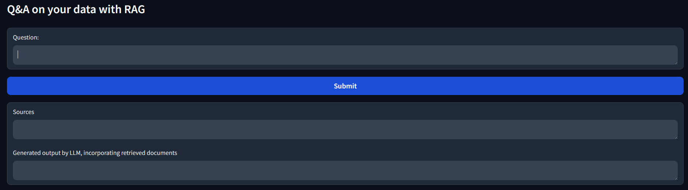
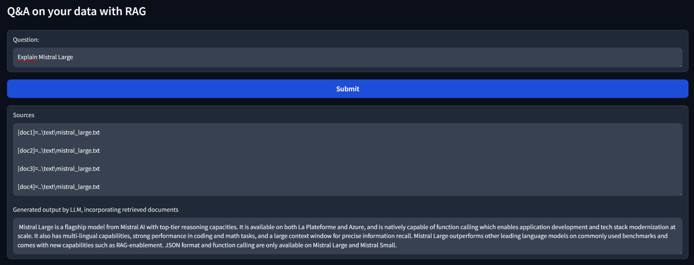

# localRAG

## Fully free, local and open-source Q&A RAG with Mistral 7B, using local documents


#### Set up:

Created & tested using Python 3.12.    
Reproducable steps to run this code:  
Along the way, you may be asked to install Microsoft C++ Build Tools. You can do so from here: https://visualstudio.microsoft.com/visual-cpp-build-tools/
1. Download or clone this repository.
2. Install Ollama.
3. In the terminal (e.g. PowerShell), run ```ollama pull mistral:instruct``` (or pull a different model of your liking, but make sure to change the variable use_llm in the Python code accordingly)
4. Set up a new Python virtual environment. For best convenience, use an IDE like PyCharm for this.
5. To install the necessary packages to the venv (virtual environment), run ```pip install gradio langchain gpt4all chromadb pypdf tiktoken``` in the terminal of the venv. If you don't want status updates printed to your terminal, run it with the quiet flag: ```pip install --quiet gradio langchain gpt4all chromadb pypdf tiktoken```.
6. Add either your pdf files to the pdf folder, or add your txt files to the text folder. Change the data_directory in the Python code according to which data you want to use for RAG.
7. Start Ollama.
8. Run the python file. The first run may take a while.
9. In the console, a local IP address will be printed. Copy it, paste it into a browser, and you can interact with your documents with RAG using a LLM. For the process of asking questions, see below.

#### Usage

1. Start the program. Here, I am using PyCharm and have the rag_chat.py file opened. If you can't find the run button, simply right-click into the text of the rag_chat.py file and select the option to run the file.  
2. Once everything is ready, a local IP address will be printed to the console. Copy this IP address, and paste it into a browser. (To the left in the picture, you can also spot the terminal button, the fifth one from the top.)  
3. Type in your question.  
4. Patiently wait for the model response. And tada! You get information from your own documents, in this case information I stored about a new Mistral model that had not been released before the model cutoff.  

#### Notes

You can run the ```pip``` command in the Python terminal in PyCharm, for example, by clicking on the terminal button in the bottom left column of the interface. This command should grab all necessary dependencies to run the code. If, for an unknown reason, running the code (step 8) gives an error, and it prompts you to install a Python package to be able to run the code, please do so.

If you ever want to switch, change, and modify which data you use for RAG, simply delete the chroma_db folder that gets created when the data is prepared for RAG during the first run of the program and re-run the program to create a new vector database.

If you are getting impatient, you can check whether the program is still running as intended by a) checking the status updates in the console, b) checking whether the model has already generated the response for you, and c) by opening the task manager and looking how much compute and memory Ollama or Python (when the vector store is still being created) is using.

#### Improvements

The performance of this RAG implementation can be improved. More documents could be retrieved, the retrieved documents could be re-ranked to pass on more relevant ones, a different embedding may yield better performance, a different language model may yield better performance, etc. I may implement some of these things in the future.

#### Acknowledgements

I have used these resources to guide and help me in writing the code:
1. https://python.langchain.com/docs/modules/data_connection/
2. https://python.langchain.com/docs/expression_language/cookbook/retrieval
3. https://www.youtube.com/watch?v=E2shqsYwxck
4. https://www.youtube.com/watch?v=JEBDfGqrAUA

The .txt and .pdf data in this repository was taken from the sources linked here: https://github.com/dair-ai/ML-Papers-of-the-Week/tree/main#top-ml-papers-of-the-week-february-26---march-3---2024
If you are the owner of the content and want me to remove it, contact me.
I don't own any of the Python packages, programs, or other, used and do not have any affiliation with any of the used packages, programs, or other.
